# Technology

- Svelte 5
- Typesafe typescript
- mongodb Atlas
- bun runtime

# Objective
- make similar application to keycloak
- having SCIM module so all aplication may get update of employee from this app
- can Manage versioning of Organisation Struture, and having report to render organisation structure using mermaid
- having more focus on management of organisation structure and Employee Data Demography
- advance sync to microsoft entraID (partial data)
- for use as multi-company entities, so employee can be assisted to other entities.
- employee may have custom properties (eg: employment status: PKWT/Perjanjian Kerja Waktu Tertentu, OS/Outsorce, etc)
- can also be use for organization partner (non-employee)

# Sample Organisation Struture

```mermaid
flowchart TD
    subgraph BOD
        direction TB
        DU[Direktur Utama] --> DC[Direktur Komersial]
        DU --> DO[Direktur Operasi]
        DU--> DR[Direktur Resiko]
        DU --> DK[Direktur Keuangan]
        DU--> DH[Direktur SDM]
    end
    BOD --> DDB
    BOD --> SBUCL
    DC -.-> SBUCL

    subgraph DIR[ ]
    subgraph SBUCL[SBU Cargo & Logistics]
        SEGM[Cargo & Logistics]
        SEGM --> SCS[Cargo Service]
        SEGM --> LOG[Logistics]
        SEGM --> CBE[Commercial & Business Excellence]
        SEGM --> CLS[Cargo & Logistics Supports]
        subgraph CSG[ ]
            GMCS[[Cargo Service]]
            CGSL(Sales)
            CI(Cargo Improvement)
            RA(Regulated Agent)
            GMCO[[Cargo Operation]]
            KNO(Regional Station KNO)
            CGK(Regional Station CGK)
            DPS(Regional Station DPS)
            UPG(Regional Station UPG)
        end 
        subgraph LOGG[ ]
            AE[[Air Express]]
            FF[[Freight Forwarder]]
            BSS[[Baggage Service Solutions]]
            CL[[Contract Logistics]]
        end 
        subgraph CBEG[ ]
            PQ(Policy and QHSE)
            KS(Key Account and Solutions)
            BIP(Business Intelligence and Performance)
            PO(Procurement Outbound)
        end
        subgraph CLSG[ ]
            SAF(Accounting & Finance)
            SHL(HC and Legal)
            SFS(Facility and System)
        end
        class SBUCL,CBEG,CSG,LOGG nofill;
        CBE ~~~ CBEG
        SCS ~~~ CSG
        LOG ~~~ LOGG
        CLS ~~~ CLSG
    end
        subgraph DDC[ ]
            direction LR
            CD[Commercial Development]
            SSM[Startegic Sales Marketing]
            BPS[Business Performance and Startegy]
        end
        subgraph DDO[ ]
            direction LR
            OPS[Operation Excellence & Standarization]
            CX[Customer Experience]
            BP[Business Portfolio]
            SAS([SDU: Aviataion Service])
            SFM([SDU: Facility Management & Manpower Service])
            SHO([SDU: Hospitality])
        end
        subgraph DDK[ ]
            direction LR
            CF[Corporate Finance]
            SPM[Startegic Performance Management]
            ACC[Accounting]
            SAM([SDU: Assets Management])
            SERP([SDU: ERP])
        end
        subgraph DDH[ ]
            direction LR
            HS[HC Strategy and Planning]
            HB[HC BP and Talent]
            HG[HC Service and GA]
            IT[Information Technology]
            SACA([SDU: IAS Academy])
        end
        subgraph DDR[ ]
            direction LR
            RM[Risk Management, Governance and Compliance]
            LG[Legal]
            PC[Procurement]
        end
        subgraph DDB[ ]
            direction LR
            IA[Internal Audit]
            CS[Corporate Secretary]
            CST[Corporate Strategy]
            SPMO([SDU PMO])
        end
    end
    
    DK --> DDK
    DC --> DDC
    DO --> DDO
    DR --> DDR
    DH --> DDH
    class DIR nostroke
    class DIR nofill
    class BOD nofill
    classDef nostroke stroke:transparent 
    classDef nofill fill:transparent
    
```


---
## show script

```javascript
function test(){
    console.log("Hello")
}
```