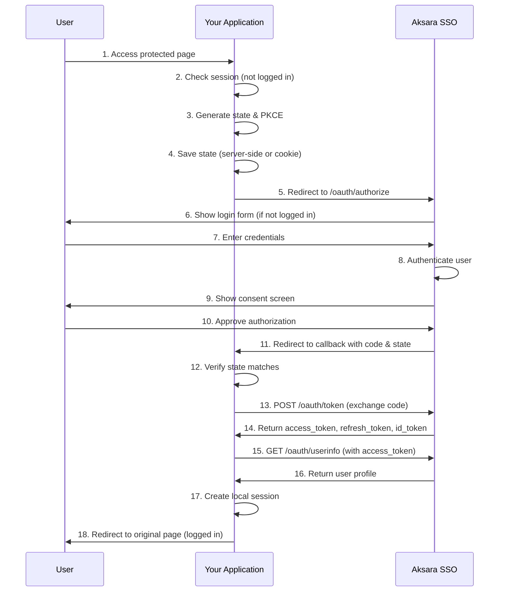

# Aksara SSO - Client Integration Guide

**Complete guide for integrating your application with Aksara SSO**

Version: 1.0
Last Updated: October 2025

---

## Table of Contents

1. [Overview](#overview)
2. [Prerequisites](#prerequisites)
3. [OAuth Client Registration](#oauth-client-registration)
4. [OAuth 2.0 / OIDC Integration](#oauth-20--oidc-integration)
5. [Common Pitfalls & Solutions](#common-pitfalls--solutions)
6. [Framework Examples](#framework-examples)
7. [Advanced Features](#advanced-features)
8. [SCIM 2.0 Integration](#scim-20-integration)
9. [Security Best Practices](#security-best-practices)
10. [Troubleshooting](#troubleshooting)

---

## Overview

Aksara SSO is a Keycloak-like Single Sign-On system that provides:

- **OAuth 2.0 / OpenID Connect (OIDC)** authentication
- **SCIM 2.0** user provisioning (coming soon)
- **Multi-realm/organization** support
- **Employee lifecycle management** integration
- **Microsoft Entra ID** synchronization

### Supported Grant Types

- ✅ **Authorization Code Flow** (recommended)
- ✅ **Authorization Code Flow with PKCE** (recommended for all clients)
- ✅ **Refresh Token** grant
- 🔜 Client Credentials
- 🔜 Resource Owner Password Credentials (not recommended)

---

## Prerequisites

Before integrating your application, ensure you have:

### 1. Network Access
- Access to Aksara SSO server (e.g., `https://sso.yourcompany.com` or `http://localhost:5173` for development)
- Ability to make HTTPS requests (TLS/SSL required in production)

### 2. Application Requirements
- A web server capable of:
  - Handling HTTP redirects
  - Making backend HTTP requests
  - Storing session data securely
  - Generating cryptographically secure random strings

### 3. Database (Optional but Recommended)
- For storing user profiles synced from SSO
- For maintaining local sessions
- Supported: MongoDB, MySQL, PostgreSQL, or any database

### 4. Administrator Access
- Contact your SSO administrator to register your OAuth client
- Provide your application's redirect URIs

---

## OAuth Client Registration

### Step 1: Request Client Credentials

Contact your Aksara SSO administrator with the following information:

```yaml
Application Name: "Your Application Name"
Description: "Brief description of your app"
Redirect URIs:
  - https://yourapp.com/auth/callback
  - https://yourapp.com/auth/silent-refresh  # Optional
  - http://localhost:3000/auth/callback      # Development only
Scopes Required:
  - openid      # Required for OIDC
  - email       # User email
  - profile     # User name and other profile info
  - roles       # User roles/permissions (optional)
Grant Types:
  - authorization_code
  - refresh_token
```

### Step 2: Receive Client Credentials

You will receive:

```json
{
  "client_id": "your-app-client-id",
  "client_secret": "your-client-secret-here",
  "issuer": "https://sso.yourcompany.com",
  "authorization_endpoint": "https://sso.yourcompany.com/oauth/authorize",
  "token_endpoint": "https://sso.yourcompany.com/oauth/token",
  "userinfo_endpoint": "https://sso.yourcompany.com/oauth/userinfo",
  "introspection_endpoint": "https://sso.yourcompany.com/oauth/introspect",
  "revocation_endpoint": "https://sso.yourcompany.com/oauth/revoke"
}
```

### Step 3: Store Credentials Securely

**CRITICAL**: Never commit credentials to version control!

**Environment Variables** (recommended):

```bash
# .env file (add to .gitignore!)
SSO_ISSUER=https://sso.yourcompany.com
SSO_AUTHORIZATION_URL=https://sso.yourcompany.com/oauth/authorize
SSO_TOKEN_URL=https://sso.yourcompany.com/oauth/token
SSO_USERINFO_URL=https://sso.yourcompany.com/oauth/userinfo
SSO_CLIENT_ID=your-app-client-id
SSO_CLIENT_SECRET=your-client-secret-here
SSO_REDIRECT_URI=https://yourapp.com/auth/callback
SSO_SCOPES=openid email profile roles

# For session encryption
SESSION_SECRET=generate-a-random-32-char-string-here
```

---

## OAuth 2.0 / OIDC Integration

### Implementation Flow



### Step-by-Step Implementation

#### 1. Implement PKCE Helper (Recommended)

PKCE (Proof Key for Code Exchange) prevents authorization code interception attacks.

**JavaScript/TypeScript**:
```typescript
// pkce.ts
import crypto from 'crypto';

function base64URLEncode(buffer: Buffer): string {
  return buffer
    .toString('base64')
    .replace(/\+/g, '-')
    .replace(/\//g, '_')
    .replace(/=/g, '');
}

export async function generateCodeVerifier(): Promise<string> {
  return base64URLEncode(crypto.randomBytes(32));
}

export async function generateCodeChallenge(verifier: string): Promise<string> {
  const hash = crypto.createHash('sha256').update(verifier).digest();
  return base64URLEncode(hash);
}

export function generateRandomString(length: number): string {
  return crypto.randomBytes(length).toString('hex');
}

export async function generatePKCEPair() {
  const codeVerifier = await generateCodeVerifier();
  const codeChallenge = await generateCodeChallenge(codeVerifier);
  return { codeVerifier, codeChallenge };
}
```

**Python**:
```python
# pkce.py
import base64
import hashlib
import secrets

def base64url_encode(data: bytes) -> str:
    return base64.urlsafe_b64encode(data).rstrip(b'=').decode('utf-8')

def generate_code_verifier() -> str:
    return base64url_encode(secrets.token_bytes(32))

def generate_code_challenge(verifier: str) -> str:
    digest = hashlib.sha256(verifier.encode('utf-8')).digest()
    return base64url_encode(digest)

def generate_random_string(length: int = 32) -> str:
    return secrets.token_hex(length)

def generate_pkce_pair():
    verifier = generate_code_verifier()
    challenge = generate_code_challenge(verifier)
    return {'code_verifier': verifier, 'code_challenge': challenge}
```

**PHP**:
```php
<?php
// pkce.php

function base64UrlEncode($data) {
    return rtrim(strtr(base64_encode($data), '+/', '-_'), '=');
}

function generateCodeVerifier() {
    return base64UrlEncode(random_bytes(32));
}

function generateCodeChallenge($verifier) {
    return base64UrlEncode(hash('sha256', $verifier, true));
}

function generateRandomString($length = 32) {
    return bin2hex(random_bytes($length));
}

function generatePKCEPair() {
    $verifier = generateCodeVerifier();
    $challenge = generateCodeChallenge($verifier);
    return [
        'code_verifier' => $verifier,
        'code_challenge' => $challenge
    ];
}
```

#### 2. Create Login Route

This initiates the OAuth flow.

**SvelteKit** (`/auth/login/+server.ts`):
```typescript
import { redirect } from '@sveltejs/kit';
import type { RequestHandler } from './$types';
import { buildAuthorizationUrl } from '$lib/server/auth/oauth';
import { saveOAuthState } from '$lib/server/auth/oauth-state';

export const GET: RequestHandler = async ({ url }) => {
  const redirectPath = url.searchParams.get('redirect') || '/';

  const { url: authUrl, state, codeVerifier } = await buildAuthorizationUrl(redirectPath);

  // Save state server-side (recommended for security)
  saveOAuthState(state, codeVerifier, redirectPath);

  throw redirect(302, authUrl);
};

// oauth.ts
export async function buildAuthorizationUrl(redirectPath: string = '/') {
  const { codeVerifier, codeChallenge } = await generatePKCEPair();
  const state = generateRandomString(32);

  const params = new URLSearchParams({
    response_type: 'code',
    client_id: SSO_CLIENT_ID,
    redirect_uri: SSO_REDIRECT_URI,
    scope: SSO_SCOPES,
    state: `${state}:${redirectPath}`,
    code_challenge: codeChallenge,
    code_challenge_method: 'S256'
  });

  const url = `${SSO_AUTHORIZATION_URL}?${params.toString()}`;

  return { url, state, codeVerifier };
}
```

**Python Flask**:
```python
from flask import redirect, request, session
import os

@app.route('/auth/login')
def auth_login():
    redirect_path = request.args.get('redirect', '/')

    pkce = generate_pkce_pair()
    state = generate_random_string()

    # Save in session (or server-side store)
    session['oauth_state'] = state
    session['code_verifier'] = pkce['code_verifier']
    session['redirect_path'] = redirect_path

    params = {
        'response_type': 'code',
        'client_id': os.getenv('SSO_CLIENT_ID'),
        'redirect_uri': os.getenv('SSO_REDIRECT_URI'),
        'scope': os.getenv('SSO_SCOPES'),
        'state': f"{state}:{redirect_path}",
        'code_challenge': pkce['code_challenge'],
        'code_challenge_method': 'S256'
    }

    auth_url = f"{os.getenv('SSO_AUTHORIZATION_URL')}?{urlencode(params)}"
    return redirect(auth_url)
```

**PHP**:
```php
<?php
// login.php

session_start();

$redirectPath = $_GET['redirect'] ?? '/';

$pkce = generatePKCEPair();
$state = generateRandomString();

// Save in session
$_SESSION['oauth_state'] = $state;
$_SESSION['code_verifier'] = $pkce['code_verifier'];
$_SESSION['redirect_path'] = $redirectPath;

$params = http_build_query([
    'response_type' => 'code',
    'client_id' => $_ENV['SSO_CLIENT_ID'],
    'redirect_uri' => $_ENV['SSO_REDIRECT_URI'],
    'scope' => $_ENV['SSO_SCOPES'],
    'state' => "$state:$redirectPath",
    'code_challenge' => $pkce['code_challenge'],
    'code_challenge_method' => 'S256'
]);

$authUrl = $_ENV['SSO_AUTHORIZATION_URL'] . '?' . $params;
header("Location: $authUrl");
exit;
```

#### 3. Create Callback Route

This handles the redirect from SSO after user authorization.

**SvelteKit** (`/auth/callback/+server.ts`):
```typescript
import { redirect, error } from '@sveltejs/kit';
import type { RequestHandler } from './$types';
import { exchangeCodeForTokens, getUserInfo } from '$lib/server/auth/oauth';
import { createSession, setSessionCookie } from '$lib/server/auth/session';
import { getOAuthState, deleteOAuthState } from '$lib/server/auth/oauth-state';

export const GET: RequestHandler = async ({ url, cookies }) => {
  const code = url.searchParams.get('code');
  const state = url.searchParams.get('state');
  const errorParam = url.searchParams.get('error');

  if (errorParam) {
    throw error(400, `SSO authentication failed: ${errorParam}`);
  }

  if (!code || !state) {
    throw error(400, 'Missing code or state parameter');
  }

  const [stateValue, redirectPath] = state.split(':');

  // Retrieve stored OAuth state
  const storedOAuthState = getOAuthState(stateValue);

  if (!storedOAuthState) {
    throw error(400, 'Invalid or expired OAuth state');
  }

  if (storedOAuthState.state !== stateValue) {
    throw error(400, 'State mismatch');
  }

  deleteOAuthState(stateValue);

  try {
    // Exchange authorization code for tokens
    const tokens = await exchangeCodeForTokens(code, storedOAuthState.codeVerifier);

    // Fetch user information
    const userInfo = await getUserInfo(tokens.access_token);

    // Create local session
    const sessionToken = await createSession(userInfo, tokens);

    setSessionCookie({ cookies }, sessionToken);

    throw redirect(302, storedOAuthState.redirectPath || '/');
  } catch (err) {
    console.error('OAuth callback error:', err);
    throw error(500, 'Authentication failed');
  }
};
```

**Token Exchange Function**:
```typescript
// oauth.ts
export async function exchangeCodeForTokens(
  code: string,
  codeVerifier: string
): Promise<OAuthTokens> {
  const params = {
    grant_type: 'authorization_code',
    code,
    client_id: SSO_CLIENT_ID,
    client_secret: SSO_CLIENT_SECRET,
    redirect_uri: SSO_REDIRECT_URI,
    code_verifier: codeVerifier
  };

  const response = await fetch(SSO_TOKEN_URL, {
    method: 'POST',
    headers: {
      'Content-Type': 'application/x-www-form-urlencoded'
    },
    body: new URLSearchParams(params)
  });

  if (!response.ok) {
    const errorText = await response.text();
    throw new Error(`Token exchange failed: ${response.status} ${errorText}`);
  }

  return await response.json();
}

export async function getUserInfo(accessToken: string): Promise<UserInfo> {
  const response = await fetch(SSO_USERINFO_URL, {
    headers: {
      Authorization: `Bearer ${accessToken}`
    }
  });

  if (!response.ok) {
    const errorText = await response.text();
    throw new Error(`Failed to fetch user info: ${response.status} ${errorText}`);
  }

  return await response.json();
}
```

**Python Flask**:
```python
import requests
from urllib.parse import urlencode

@app.route('/auth/callback')
def auth_callback():
    code = request.args.get('code')
    state = request.args.get('state')
    error = request.args.get('error')

    if error:
        return f"Authentication failed: {error}", 400

    if not code or not state:
        return "Missing code or state", 400

    state_value, redirect_path = state.split(':', 1)

    # Verify state
    if session.get('oauth_state') != state_value:
        return "Invalid state", 400

    code_verifier = session.pop('code_verifier', None)
    session.pop('oauth_state', None)

    # Exchange code for tokens
    token_data = {
        'grant_type': 'authorization_code',
        'code': code,
        'client_id': os.getenv('SSO_CLIENT_ID'),
        'client_secret': os.getenv('SSO_CLIENT_SECRET'),
        'redirect_uri': os.getenv('SSO_REDIRECT_URI'),
        'code_verifier': code_verifier
    }

    response = requests.post(
        os.getenv('SSO_TOKEN_URL'),
        data=token_data,
        headers={'Content-Type': 'application/x-www-form-urlencoded'}
    )

    if response.status_code != 200:
        return f"Token exchange failed: {response.text}", 500

    tokens = response.json()

    # Fetch user info
    userinfo_response = requests.get(
        os.getenv('SSO_USERINFO_URL'),
        headers={'Authorization': f"Bearer {tokens['access_token']}"}
    )

    user_info = userinfo_response.json()

    # Create session
    session['user'] = user_info
    session['tokens'] = tokens

    return redirect(redirect_path or '/')
```

#### 4. Implement Session Management

**Encrypted Session (TypeScript)**:
```typescript
// session.ts
import { SESSION_SECRET } from '$env/static/private';

const encoder = new TextEncoder();
const decoder = new TextDecoder();

async function getKey(): Promise<CryptoKey> {
  const keyMaterial = await crypto.subtle.importKey(
    'raw',
    encoder.encode(SESSION_SECRET),
    { name: 'PBKDF2' },
    false,
    ['deriveBits', 'deriveKey']
  );

  return crypto.subtle.deriveKey(
    {
      name: 'PBKDF2',
      salt: encoder.encode('session-salt'),
      iterations: 100000,
      hash: 'SHA-256'
    },
    keyMaterial,
    { name: 'AES-GCM', length: 256 },
    false,
    ['encrypt', 'decrypt']
  );
}

async function encrypt(data: string): Promise<string> {
  const key = await getKey();
  const iv = crypto.getRandomValues(new Uint8Array(12));
  const encrypted = await crypto.subtle.encrypt(
    { name: 'AES-GCM', iv },
    key,
    encoder.encode(data)
  );

  const combined = new Uint8Array(iv.length + encrypted.byteLength);
  combined.set(iv, 0);
  combined.set(new Uint8Array(encrypted), iv.length);

  return btoa(String.fromCharCode(...combined))
    .replace(/\+/g, '-')
    .replace(/\//g, '_')
    .replace(/=/g, '');
}

async function decrypt(encryptedData: string): Promise<string> {
  const key = await getKey();
  const data = Uint8Array.from(
    atob(encryptedData.replace(/-/g, '+').replace(/_/g, '/')),
    (c) => c.charCodeAt(0)
  );

  const iv = data.slice(0, 12);
  const ciphertext = data.slice(12);

  const decrypted = await crypto.subtle.decrypt(
    { name: 'AES-GCM', iv },
    key,
    ciphertext
  );

  return decoder.decode(decrypted);
}

export interface SessionData {
  userId: string;
  email: string;
  name?: string;
  tokens: OAuthTokens;
  expiresAt: number;
}

export async function createSession(
  userInfo: UserInfo,
  tokens: OAuthTokens
): Promise<string> {
  const sessionData: SessionData = {
    userId: userInfo.sub,
    email: userInfo.email,
    name: userInfo.name,
    tokens,
    expiresAt: Date.now() + tokens.expires_in * 1000
  };

  return await encrypt(JSON.stringify(sessionData));
}

export async function getSession(
  sessionCookie: string | undefined
): Promise<SessionData | null> {
  if (!sessionCookie) return null;

  try {
    const decrypted = await decrypt(sessionCookie);
    const session: SessionData = JSON.parse(decrypted);

    if (Date.now() > session.expiresAt) {
      return null;
    }

    return session;
  } catch (error) {
    return null;
  }
}
```

#### 5. Implement Token Refresh

**Automatic Token Refresh**:
```typescript
// oauth.ts
export async function refreshAccessToken(
  refreshToken: string
): Promise<OAuthTokens> {
  const response = await fetch(SSO_TOKEN_URL, {
    method: 'POST',
    headers: {
      'Content-Type': 'application/x-www-form-urlencoded'
    },
    body: new URLSearchParams({
      grant_type: 'refresh_token',
      refresh_token: refreshToken,
      client_id: SSO_CLIENT_ID,
      client_secret: SSO_CLIENT_SECRET
    })
  });

  if (!response.ok) {
    throw new Error('Token refresh failed');
  }

  return await response.json();
}

// session.ts
export async function refreshSession(
  session: SessionData
): Promise<string> {
  const newTokens = await refreshAccessToken(session.tokens.refresh_token);
  const userInfo = await getUserInfo(newTokens.access_token);

  session.tokens = newTokens;
  session.expiresAt = Date.now() + newTokens.expires_in * 1000;
  session.name = userInfo.name || session.name;

  return await encrypt(JSON.stringify(session));
}
```

**Middleware for Auto-Refresh** (SvelteKit `hooks.server.ts`):
```typescript
import { getSession, refreshSession, setSessionCookie } from '$lib/server/auth/session';

export const handle: Handle = async ({ event, resolve }) => {
  const sessionCookie = event.cookies.get('app_session');

  if (sessionCookie) {
    let session = await getSession(sessionCookie);

    if (session) {
      // Refresh if expiring within 15 minutes
      const timeUntilExpiry = session.expiresAt - Date.now();
      const fifteenMinutes = 15 * 60 * 1000;

      if (timeUntilExpiry < fifteenMinutes && timeUntilExpiry > 0) {
        try {
          const newSessionToken = await refreshSession(session);
          setSessionCookie(event, newSessionToken);
          session = await getSession(newSessionToken);
        } catch (error) {
          // Refresh failed, clear session
          event.cookies.delete('app_session', { path: '/' });
          session = null;
        }
      }

      if (session) {
        event.locals.user = {
          userId: session.userId,
          email: session.email,
          name: session.name
        };
      }
    }
  }

  return resolve(event);
};
```

#### 6. Implement Logout

**SvelteKit** (`/auth/logout/+server.ts`):
```typescript
import { redirect } from '@sveltejs/kit';
import type { RequestHandler } from './$types';
import { revokeToken } from '$lib/server/auth/oauth';
import { getSession, clearSessionCookie } from '$lib/server/auth/session';

export const POST: RequestHandler = async ({ cookies }) => {
  const sessionCookie = cookies.get('app_session');
  const session = await getSession(sessionCookie);

  // Revoke refresh token at SSO
  if (session) {
    try {
      await revokeToken(session.tokens.refresh_token, 'refresh_token');
    } catch (error) {
      console.error('Token revocation failed:', error);
    }
  }

  // Clear local session
  clearSessionCookie({ cookies });

  throw redirect(302, '/');
};
```

**Token Revocation**:
```typescript
// oauth.ts
export async function revokeToken(
  token: string,
  tokenTypeHint: 'access_token' | 'refresh_token' = 'refresh_token'
): Promise<void> {
  const revokeUrl = SSO_TOKEN_URL.replace('/token', '/revoke');

  await fetch(revokeUrl, {
    method: 'POST',
    headers: {
      'Content-Type': 'application/x-www-form-urlencoded'
    },
    body: new URLSearchParams({
      token,
      token_type_hint: tokenTypeHint,
      client_id: SSO_CLIENT_ID,
      client_secret: SSO_CLIENT_SECRET
    })
  });
}
```

---

## Common Pitfalls & Solutions

### 1. ⚠️ Client Secret Verification Fails

**Error**: `401 Invalid client credentials` or `400 Invalid request`

**Cause**: Aksara SSO stores client secrets hashed with **Argon2**. The token endpoint must use Argon2 verification, not plain text comparison.

**Solution**: Ensure your SSO server uses Argon2 verification:

```typescript
// ❌ WRONG (plain text comparison)
if (client.client_secret !== providedSecret) {
  throw error(401, 'Invalid credentials');
}

// ✅ CORRECT (Argon2 verification)
import { verify } from 'argon2';

if (!client) {
  throw error(401, 'Invalid client credentials');
}

const isValidSecret = await verify(client.client_secret, providedSecret);
if (!isValidSecret) {
  throw error(401, 'Invalid client credentials');
}
```

### 2. ⚠️ JWT Token Generation Error

**Error**: `Bad "options.expiresIn" option the payload already has an "exp" property`

**Cause**: ID token payload manually sets `exp` while `jwt.sign()` also tries to set it via `expiresIn` option.

**Solution**: Remove manual `iat` and `exp` from payload:

```typescript
// ❌ WRONG
const idTokenPayload = {
  sub: user.id,
  email: user.email,
  iat: Math.floor(Date.now() / 1000),  // Remove
  exp: Math.floor(Date.now() / 1000) + 3600  // Remove
};
idToken = createJWT(idTokenPayload, '1h');

// ✅ CORRECT
const idTokenPayload = {
  sub: user.id,
  email: user.email
  // iat and exp will be added automatically
};
idToken = createJWT(idTokenPayload, '1h');
```

### 3. ⚠️ Cross-Origin Cookie Issues

**Error**: OAuth state or code verifier "missing" or "expired" during callback

**Cause**: Cookies set on `localhost:3000` don't persist across redirect to `localhost:5173` and back due to:
- Cross-port cookie restrictions
- SameSite policies

**Solutions**:

**Option A: Server-Side State Storage** (Recommended for development):
```typescript
// oauth-state.ts
const stateStore = new Map<string, OAuthState>();

export function saveOAuthState(state: string, codeVerifier: string, redirectPath: string) {
  stateStore.set(state, {
    state,
    codeVerifier,
    redirectPath,
    createdAt: Date.now()
  });
}

export function getOAuthState(state: string): OAuthState | null {
  const stored = stateStore.get(state);
  if (!stored) return null;

  // 10 minute expiry
  if (Date.now() - stored.createdAt > 10 * 60 * 1000) {
    stateStore.delete(state);
    return null;
  }

  return stored;
}
```

**Option B: Same-Domain Deployment** (Production):
- Deploy SSO and apps on same domain: `sso.company.com` and `app.company.com`
- Cookies will work across subdomains with proper configuration

### 4. ⚠️ CSRF Protection Blocking OAuth Endpoints

**Error**: `403 Cross-site POST form submissions are forbidden`

**Cause**: SvelteKit's CSRF protection blocks cross-origin POST requests to `/oauth/token`

**Solution**: Disable CSRF checking for OAuth endpoints:

**svelte.config.js**:
```javascript
kit: {
  csrf: {
    checkOrigin: false  // Or whitelist specific origins
  }
}
```

**hooks.server.ts** (more targeted):
```typescript
export const handle: Handle = async ({ event, resolve }) => {
  // Bypass CSRF for OAuth endpoints
  if (event.url.pathname.startsWith('/oauth/')) {
    return await resolve(event, {
      filterSerializedResponseHeaders: (name) => name === 'content-type'
    });
  }

  return resolve(event);
};
```

### 5. ⚠️ State Management Best Practices

**Development**: Use server-side Map (in-memory)
- ✅ Survives cross-origin redirects
- ⚠️ Lost on server restart (acceptable for dev)
- ⚠️ Not suitable for multi-instance deployments

**Production**: Use Redis or database
```typescript
// redis-state.ts
import Redis from 'ioredis';

const redis = new Redis(process.env.REDIS_URL);

export async function saveOAuthState(state: string, data: OAuthState) {
  await redis.setex(`oauth:${state}`, 600, JSON.stringify(data));
}

export async function getOAuthState(state: string): Promise<OAuthState | null> {
  const data = await redis.get(`oauth:${state}`);
  return data ? JSON.parse(data) : null;
}

export async function deleteOAuthState(state: string) {
  await redis.del(`oauth:${state}`);
}
```

### 6. ⚠️ SvelteKit Form Action URL Issues

**Error**: Malformed URLs like `http://localhost:5173/oauth/authorize?/authorize`

**Cause**: Named form actions (`action="?/authorize"`) on pages with existing query parameters

**Solution**: Use default action with hidden field discriminator:

```svelte
<!-- ❌ WRONG -->
<form method="POST" action="?/login">...</form>
<form method="POST" action="?/authorize">...</form>

<!-- ✅ CORRECT -->
<form method="POST">
  <input type="hidden" name="action" value="login" />
  ...
</form>
<form method="POST">
  <input type="hidden" name="action" value="authorize" />
  ...
</form>
```

```typescript
// +page.server.ts
export const actions: Actions = {
  default: async ({ request }) => {
    const formData = await request.formData();
    const actionType = formData.get('action');

    if (actionType === 'login') {
      // Handle login
    } else {
      // Handle authorize
    }
  }
};
```

---

## Framework Examples

### SvelteKit Complete Example

See the **OFM (Office Facility Management)** project for a complete, production-ready implementation:

**Project Structure**:
```
src/
├── lib/
│   └── server/
│       └── auth/
│           ├── pkce.ts              # PKCE generation
│           ├── oauth.ts             # OAuth client functions
│           ├── oauth-state.ts       # Server-side state storage
│           ├── session.ts           # Encrypted session management
│           └── sync.ts              # User sync from SSO
├── routes/
│   ├── auth/
│   │   ├── login/+server.ts         # Initiate OAuth flow
│   │   ├── callback/+server.ts      # Handle OAuth callback
│   │   └── logout/+server.ts        # Logout and revoke tokens
│   └── +page.svelte                 # Homepage with login button
└── hooks.server.ts                  # Auto token refresh middleware
```

**Environment Variables** (`.env`):
```bash
SSO_ISSUER=http://localhost:5173
SSO_AUTHORIZATION_URL=http://localhost:5173/oauth/authorize
SSO_TOKEN_URL=http://localhost:5173/oauth/token
SSO_USERINFO_URL=http://localhost:5173/oauth/userinfo
SSO_CLIENT_ID=ofm-client
SSO_CLIENT_SECRET=ofm-secret-2025
SSO_REDIRECT_URI=http://localhost:5174/auth/callback
SSO_SCOPES=openid email profile roles
SESSION_SECRET=your-32-char-random-secret-here
```

### Nuxt 3 Example

```typescript
// server/utils/oauth.ts
export async function buildAuthorizationUrl(redirectPath: string = '/') {
  const config = useRuntimeConfig();
  const { codeVerifier, codeChallenge } = await generatePKCEPair();
  const state = generateRandomString(32);

  const params = new URLSearchParams({
    response_type: 'code',
    client_id: config.ssoClientId,
    redirect_uri: config.ssoRedirectUri,
    scope: config.ssoScopes,
    state: `${state}:${redirectPath}`,
    code_challenge: codeChallenge,
    code_challenge_method: 'S256'
  });

  return {
    url: `${config.ssoAuthorizationUrl}?${params}`,
    state,
    codeVerifier
  };
}

// server/api/auth/login.get.ts
export default defineEventHandler(async (event) => {
  const query = getQuery(event);
  const redirectPath = query.redirect as string || '/';

  const { url, state, codeVerifier } = await buildAuthorizationUrl(redirectPath);

  // Save to session or server-side store
  const session = await useSession(event, {
    password: process.env.SESSION_SECRET
  });

  await session.update({
    oauthState: state,
    codeVerifier,
    redirectPath
  });

  return sendRedirect(event, url);
});

// server/api/auth/callback.get.ts
export default defineEventHandler(async (event) => {
  const query = getQuery(event);
  const code = query.code as string;
  const state = query.state as string;

  if (!code || !state) {
    throw createError({
      statusCode: 400,
      message: 'Missing code or state'
    });
  }

  const session = await useSession(event, {
    password: process.env.SESSION_SECRET
  });

  const [stateValue, redirectPath] = state.split(':');

  if (session.data.oauthState !== stateValue) {
    throw createError({
      statusCode: 400,
      message: 'Invalid state'
    });
  }

  const tokens = await exchangeCodeForTokens(code, session.data.codeVerifier);
  const userInfo = await getUserInfo(tokens.access_token);

  // Update session with user data
  await session.update({
    user: userInfo,
    tokens,
    oauthState: undefined,
    codeVerifier: undefined
  });

  return sendRedirect(event, redirectPath || '/');
});
```

### Python FastAPI Example

```python
from fastapi import FastAPI, Request, Response
from fastapi.responses import RedirectResponse
from starlette.middleware.sessions import SessionMiddleware
import httpx
import os

app = FastAPI()
app.add_middleware(SessionMiddleware, secret_key=os.getenv('SESSION_SECRET'))

@app.get('/auth/login')
async def auth_login(request: Request, redirect: str = '/'):
    pkce = generate_pkce_pair()
    state = generate_random_string()

    request.session['oauth_state'] = state
    request.session['code_verifier'] = pkce['code_verifier']
    request.session['redirect_path'] = redirect

    params = {
        'response_type': 'code',
        'client_id': os.getenv('SSO_CLIENT_ID'),
        'redirect_uri': os.getenv('SSO_REDIRECT_URI'),
        'scope': os.getenv('SSO_SCOPES'),
        'state': f"{state}:{redirect}",
        'code_challenge': pkce['code_challenge'],
        'code_challenge_method': 'S256'
    }

    auth_url = f"{os.getenv('SSO_AUTHORIZATION_URL')}?{urlencode(params)}"
    return RedirectResponse(auth_url)

@app.get('/auth/callback')
async def auth_callback(request: Request, code: str, state: str):
    state_value, redirect_path = state.split(':', 1)

    if request.session.get('oauth_state') != state_value:
        raise HTTPException(400, 'Invalid state')

    code_verifier = request.session.pop('code_verifier')
    request.session.pop('oauth_state')

    async with httpx.AsyncClient() as client:
        # Exchange code for tokens
        token_response = await client.post(
            os.getenv('SSO_TOKEN_URL'),
            data={
                'grant_type': 'authorization_code',
                'code': code,
                'client_id': os.getenv('SSO_CLIENT_ID'),
                'client_secret': os.getenv('SSO_CLIENT_SECRET'),
                'redirect_uri': os.getenv('SSO_REDIRECT_URI'),
                'code_verifier': code_verifier
            }
        )

        tokens = token_response.json()

        # Get user info
        userinfo_response = await client.get(
            os.getenv('SSO_USERINFO_URL'),
            headers={'Authorization': f"Bearer {tokens['access_token']}"}
        )

        user_info = userinfo_response.json()

    request.session['user'] = user_info
    request.session['tokens'] = tokens

    return RedirectResponse(redirect_path or '/')
```

### PHP Laravel Example

```php
<?php
// routes/web.php
Route::get('/auth/login', [AuthController::class, 'login']);
Route::get('/auth/callback', [AuthController::class, 'callback']);
Route::post('/auth/logout', [AuthController::class, 'logout']);

// app/Http/Controllers/AuthController.php
namespace App\Http\Controllers;

use Illuminate\Http\Request;
use Illuminate\Support\Facades\Http;

class AuthController extends Controller
{
    public function login(Request $request)
    {
        $redirectPath = $request->query('redirect', '/');

        $pkce = $this->generatePKCEPair();
        $state = bin2hex(random_bytes(32));

        session([
            'oauth_state' => $state,
            'code_verifier' => $pkce['code_verifier'],
            'redirect_path' => $redirectPath
        ]);

        $params = http_build_query([
            'response_type' => 'code',
            'client_id' => env('SSO_CLIENT_ID'),
            'redirect_uri' => env('SSO_REDIRECT_URI'),
            'scope' => env('SSO_SCOPES'),
            'state' => "$state:$redirectPath",
            'code_challenge' => $pkce['code_challenge'],
            'code_challenge_method' => 'S256'
        ]);

        $authUrl = env('SSO_AUTHORIZATION_URL') . '?' . $params;
        return redirect($authUrl);
    }

    public function callback(Request $request)
    {
        $code = $request->query('code');
        $state = $request->query('state');

        if (!$code || !$state) {
            abort(400, 'Missing code or state');
        }

        [$stateValue, $redirectPath] = explode(':', $state, 2);

        if (session('oauth_state') !== $stateValue) {
            abort(400, 'Invalid state');
        }

        $codeVerifier = session()->pull('code_verifier');
        session()->forget('oauth_state');

        // Exchange code for tokens
        $tokenResponse = Http::asForm()->post(env('SSO_TOKEN_URL'), [
            'grant_type' => 'authorization_code',
            'code' => $code,
            'client_id' => env('SSO_CLIENT_ID'),
            'client_secret' => env('SSO_CLIENT_SECRET'),
            'redirect_uri' => env('SSO_REDIRECT_URI'),
            'code_verifier' => $codeVerifier
        ]);

        $tokens = $tokenResponse->json();

        // Get user info
        $userinfoResponse = Http::withToken($tokens['access_token'])
            ->get(env('SSO_USERINFO_URL'));

        $userInfo = $userinfoResponse->json();

        session([
            'user' => $userInfo,
            'tokens' => $tokens
        ]);

        return redirect($redirectPath ?: '/');
    }

    private function generatePKCEPair()
    {
        $verifier = rtrim(strtr(base64_encode(random_bytes(32)), '+/', '-_'), '=');
        $challenge = rtrim(strtr(base64_encode(hash('sha256', $verifier, true)), '+/', '-_'), '=');

        return [
            'code_verifier' => $verifier,
            'code_challenge' => $challenge
        ];
    }
}
```

---

## Advanced Features

### Silent Authentication (iframe)

For seamless token refresh without user interaction:

```typescript
// silent-refresh.ts
export async function silentRefresh(): Promise<boolean> {
  return new Promise((resolve) => {
    const iframe = document.createElement('iframe');
    iframe.style.display = 'none';
    iframe.src = '/auth/silent-refresh';

    const timeout = setTimeout(() => {
      cleanup();
      resolve(false);
    }, 10000);

    const messageHandler = (event: MessageEvent) => {
      if (event.data.type === 'silent-refresh-success') {
        cleanup();
        resolve(true);
      } else if (event.data.type === 'silent-refresh-error') {
        cleanup();
        resolve(false);
      }
    };

    const cleanup = () => {
      clearTimeout(timeout);
      window.removeEventListener('message', messageHandler);
      iframe.remove();
    };

    window.addEventListener('message', messageHandler);
    document.body.appendChild(iframe);
  });
}
```

### Token Introspection

Validate tokens on the server:

```typescript
export async function introspectToken(token: string): Promise<boolean> {
  const response = await fetch(SSO_INTROSPECTION_URL, {
    method: 'POST',
    headers: {
      'Content-Type': 'application/x-www-form-urlencoded'
    },
    body: new URLSearchParams({
      token,
      client_id: SSO_CLIENT_ID,
      client_secret: SSO_CLIENT_SECRET
    })
  });

  const result = await response.json();
  return result.active === true;
}
```

### Single Logout (SLO)

Logout from all connected applications:

```typescript
export async function singleLogout(idToken: string) {
  const params = new URLSearchParams({
    id_token_hint: idToken,
    post_logout_redirect_uri: 'https://yourapp.com/'
  });

  window.location.href = `${SSO_ISSUER}/logout?${params}`;
}
```

---

## SCIM 2.0 Integration

**Status**: 🔜 Coming Soon

SCIM (System for Cross-domain Identity Management) enables automated user provisioning.

### Planned Endpoints

```
GET    /scim/v2/Users          # List users
GET    /scim/v2/Users/:id      # Get user
POST   /scim/v2/Users          # Create user
PUT    /scim/v2/Users/:id      # Update user (full)
PATCH  /scim/v2/Users/:id      # Update user (partial)
DELETE /scim/v2/Users/:id      # Delete user

GET    /scim/v2/Groups         # List groups
GET    /scim/v2/Groups/:id     # Get group
POST   /scim/v2/Groups         # Create group
```

### Example Usage (Planned)

```typescript
// Provision user from SSO to your app
const response = await fetch('https://sso.company.com/scim/v2/Users', {
  method: 'POST',
  headers: {
    'Authorization': 'Bearer <scim-token>',
    'Content-Type': 'application/scim+json'
  },
  body: JSON.stringify({
    schemas: ['urn:ietf:params:scim:schemas:core:2.0:User'],
    userName: 'john.doe@company.com',
    name: {
      givenName: 'John',
      familyName: 'Doe'
    },
    emails: [{
      value: 'john.doe@company.com',
      type: 'work',
      primary: true
    }],
    active: true
  })
});
```

---

## Security Best Practices

### 1. Always Use HTTPS in Production

```bash
# ❌ Development only
SSO_ISSUER=http://localhost:5173

# ✅ Production
SSO_ISSUER=https://sso.yourcompany.com
```

### 2. Secure Credential Storage

```bash
# ❌ Never commit to git
client_secret=abc123

# ✅ Use environment variables
SSO_CLIENT_SECRET=${SECRET_FROM_ENV}

# ✅ Or encrypted secret management
# (AWS Secrets Manager, HashiCorp Vault, etc.)
```

### 3. Validate Redirect URIs

Ensure SSO only redirects to whitelisted URIs:

```typescript
const allowedRedirectUris = [
  'https://app.company.com/auth/callback',
  'https://app.company.com/auth/silent-refresh'
];

if (!allowedRedirectUris.includes(redirectUri)) {
  throw error(400, 'Invalid redirect URI');
}
```

### 4. Short-Lived Tokens

- Access tokens: 1 hour (default)
- Refresh tokens: 30 days (configurable)
- Authorization codes: 10 minutes

### 5. Implement CSRF Protection

Use `state` parameter to prevent CSRF attacks:

```typescript
// Always verify state matches
if (storedState !== receivedState) {
  throw error(400, 'CSRF attack detected');
}
```

### 6. Use PKCE (Proof Key for Code Exchange)

Mandatory for public clients, recommended for all:

```typescript
// Always include PKCE in authorization request
const params = {
  // ...
  code_challenge: codeChallenge,
  code_challenge_method: 'S256'
};

// Include code_verifier in token exchange
const tokenParams = {
  // ...
  code_verifier: codeVerifier
};
```

### 7. Rotate Secrets Regularly

- Client secrets: Every 90 days
- Session secrets: Every year
- Revoke compromised tokens immediately

### 8. Audit Logging

Log all authentication events:

```typescript
logger.info('OAuth login initiated', {
  client_id: SSO_CLIENT_ID,
  user_email: userInfo.email,
  timestamp: new Date(),
  ip_address: request.ip
});
```

---

## Troubleshooting

### Issue: "Invalid client credentials" (401)

**Possible Causes**:
1. Wrong client ID or secret
2. SSO server using Argon2 hashing but token endpoint doing plain text comparison

**Solutions**:
1. Verify credentials in `.env` match registered client
2. Check SSO server token endpoint uses Argon2 verification (see Common Pitfalls #1)

### Issue: "Invalid or expired OAuth state" (400)

**Possible Causes**:
1. State expired (>10 minutes)
2. Server restarted (in-memory state lost)
3. Cross-origin cookie issues

**Solutions**:
1. Complete OAuth flow within 10 minutes
2. Use Redis/database for state storage in production
3. Use server-side state storage (see Common Pitfalls #3)

### Issue: "Token exchange failed" (400/500)

**Possible Causes**:
1. Invalid authorization code (already used or expired)
2. Mismatched redirect URI
3. Missing or invalid PKCE verifier
4. JWT generation error (see Common Pitfalls #2)

**Solutions**:
1. Ensure code is only used once
2. Verify redirect URI matches exactly
3. Include `code_verifier` in token request
4. Check SSO server JWT implementation

### Issue: Redirect loop or "Session not found"

**Possible Causes**:
1. Session cookie not being set
2. Cookie domain/path mismatch
3. httpOnly or secure flags preventing access

**Solutions**:
```typescript
// Ensure proper cookie configuration
event.cookies.set('session', token, {
  path: '/',
  httpOnly: true,
  secure: process.env.NODE_ENV === 'production',
  sameSite: 'lax',
  maxAge: 60 * 60 * 24 * 30  // 30 days
});
```

### Issue: CORS errors

**Possible Causes**:
1. Missing CORS headers on SSO server
2. Credentials not included in requests

**Solutions**:
```typescript
// SSO server
export const handle: Handle = async ({ event, resolve }) => {
  if (event.url.pathname.startsWith('/oauth/')) {
    const response = await resolve(event);
    response.headers.set('Access-Control-Allow-Origin', 'https://yourapp.com');
    response.headers.set('Access-Control-Allow-Credentials', 'true');
    return response;
  }
  return resolve(event);
};

// Client
fetch(SSO_TOKEN_URL, {
  credentials: 'include',  // Important!
  // ...
});
```

### Debugging Tips

**Enable verbose logging**:
```typescript
console.log('🔐 OAuth state:', { state, codeVerifier, redirectPath });
console.log('✅ Tokens received:', tokens);
console.log('👤 User info:', userInfo);
```

**Check network requests**:
1. Open browser DevTools → Network tab
2. Look for redirects to `/oauth/authorize`
3. Check callback URL includes `code` and `state`
4. Inspect POST to `/oauth/token` (should return tokens)
5. Verify GET to `/oauth/userinfo` (should return user data)

**Test with curl**:
```bash
# Test token endpoint
curl -X POST http://localhost:5173/oauth/token \
  -H "Content-Type: application/x-www-form-urlencoded" \
  -d "grant_type=authorization_code" \
  -d "code=<authorization-code>" \
  -d "client_id=your-client-id" \
  -d "client_secret=your-client-secret" \
  -d "redirect_uri=http://localhost:3000/auth/callback" \
  -d "code_verifier=<code-verifier>"

# Test userinfo endpoint
curl http://localhost:5173/oauth/userinfo \
  -H "Authorization: Bearer <access-token>"
```

---

## Support & Resources

### Documentation
- [OAuth 2.0 RFC 6749](https://datatracker.ietf.org/doc/html/rfc6749)
- [OpenID Connect Core](https://openid.net/specs/openid-connect-core-1_0.html)
- [PKCE RFC 7636](https://datatracker.ietf.org/doc/html/rfc7636)
- [SCIM 2.0 RFC 7644](https://datatracker.ietf.org/doc/html/rfc7644)

### Example Projects
- **OFM (Office Facility Management)**: Complete SvelteKit integration
  - Path: `/Users/HERIAWAN/Project/_mya/jss/OFM`
  - See: `src/lib/server/auth/*` and `src/routes/auth/*`

### Getting Help
1. Check this guide's [Troubleshooting](#troubleshooting) section
2. Review [Common Pitfalls](#common-pitfalls--solutions)
3. Contact your SSO administrator
4. Open an issue in the Aksara SSO repository

---

## Changelog

**Version 1.0** (October 2025)
- Initial release
- OAuth 2.0 / OIDC complete guide
- PKCE implementation
- Framework examples (SvelteKit, Nuxt, Python, PHP)
- Common pitfalls and solutions
- Security best practices

---

**End of Guide**

For updates and additional features, check the Aksara SSO documentation regularly.
