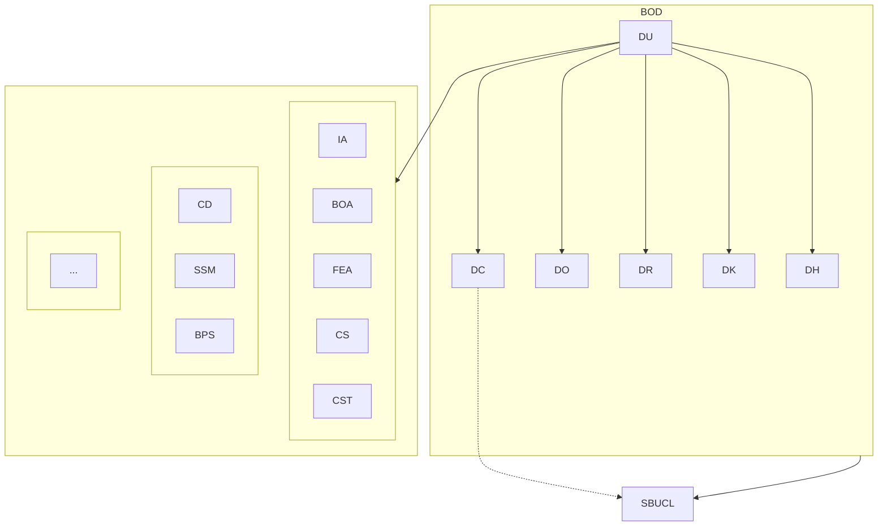

# 🔧 STO Data Fix Guide

## Current Database Issues Found

Based on database query results, the following issues need to be fixed to get correct STO rendering:

---

## 🔴 Critical Issues

### 1. **BOD (Board of Directors) is Missing**
**Problem:** BOD unit doesn't exist in database
**Expected:** BOD should exist as top-level unit containing all directors

**Action Required:**
- Create new org_unit: `BOD - Board of Directors`
- Fields:
  - `code`: `BOD`
  - `name`: `Board of Directors`
  - `parentId`: `null` (top-level)
  - `type`: `board`
  - `level`: 1
  - `organizationId`: (your IAS organization ID)

---

### 2. **DU (Direktur Utama) has Invalid Parent**
**Current:**
```
DU.parentId = 68f511f8fc205f99615b5b84 (DOESN'T EXIST!)
```

**Should be:**
```
DU.parentId = BOD._id  (after BOD is created)
```

**Action Required:**
1. First, create BOD (see issue #1)
2. Then, update DU:
   - Set `parentId` to BOD's `_id`

---

### 3. **IA (Internal Audit) has Invalid Parent**
**Current:**
```
IA.parentId = 68f511f8fc205f99615b5b84 (DOESN'T EXIST!)
```

**Should be:**
```
IA.parentId = null  (independent function)
```

**Action Required:**
- Edit IA unit
- Set `parentId` to `null` (select "-- No Parent (Top Level) --")
- IA will be placed in DDB logical group via mermaid config, not database parentId

---

### 4. **CD (Commercial Development) is Missing Parent**
**Current:**
```
CD.parentId = null
```

**Should be:**
```
CD.parentId = DC._id  (Direktur Komersial)
```

**Action Required:**
- Edit CD unit
- Find DC (Direktur Komersial) from dropdown
- Set `parentId` to DC

---

## ✅ Correct Structure After Fixes

```
Database Hierarchy (parentId):
BOD (parentId: null)
└── DU (parentId: BOD)
    ├── DC (parentId: DU)
    │   ├── CD (parentId: DC)  ← FIX THIS
    │   ├── SSM (parentId: DC)
    │   └── BPS (parentId: DC)
    ├── DO (parentId: DU)
    ├── DR (parentId: DU)
    ├── DK (parentId: DU)
    └── DH (parentId: DU)

IA (parentId: null)  ← FIX THIS

Logical Groups (mermaid config):
DIR (parent: null)
├── DDB (parent: DIR)
│   └── contains: [IA, BOA, FEA, CS, CST, ...]
├── DDC (parent: DIR)
│   └── contains: [CD, SSM, BPS, ...]
├── DDO (parent: DIR)
├── DDR (parent: DIR)
├── DDK (parent: DIR)
└── DDH (parent: DIR)
```

---

## 📋 Step-by-Step Fix Process

### Step 1: Create BOD Unit
1. Go to `/org-units`
2. Click "+ Tambah Unit Kerja"
3. Fill form:
   - Code: `BOD`
   - Name: `Board of Directors`
   - Parent: `-- No Parent (Top Level) --`
   - Type: `Board`
   - Active: ✓
4. Save

### Step 2: Fix DU's Parent
1. Go to `/org-structure/[version-id]/sto`
2. Click on DU node in diagram
3. In edit modal:
   - Parent Unit: Select `BOD - Board of Directors`
4. Save

### Step 3: Fix IA's Parent
1. Click on IA node in diagram
2. In edit modal:
   - Parent Unit: Select `-- No Parent (Top Level) --`
3. Save

### Step 4: Fix CD's Parent
1. Click on CD node in diagram
2. In edit modal:
   - Parent Unit: Select `DC - Direktur Komersial`
3. Save

### Step 5: Update Mermaid Config
1. Click "📐 Show Config Editor"
2. Click "⚡ Auto-Generate Config" (this will create correct logical groups)
3. Or manually create logical groups:
   - **DIR** (top-level)
     - Parent: `-- No Parent (Top Level) --`
     - Contains: `DDB, DDC, DDO, DDR, DDK, DDH`
   - **DDB** (nested in DIR)
     - Parent: `DIR`
     - Contains: `IA, BOA, FEA, CS, CST, SPMO`
   - **DDC** (nested in DIR)
     - Parent: `DIR`
     - Contains: `CD, SSM, BPS`
   - (repeat for DDO, DDR, DDK, DDH)

### Step 6: Save & Regenerate
1. Click "💾 Save & Regenerate"
2. Check diagram rendering

---

## 🎯 Expected STO Result

After fixes, STO should show:



---

## 🔍 Verification Queries

Run these queries to verify fixes:

```typescript
// Check BOD exists
db.org_units.findOne({ code: 'BOD' })

// Check DU parent
db.org_units.findOne({ code: 'DU' }).parentId should equal BOD._id

// Check IA parent
db.org_units.findOne({ code: 'IA' }).parentId should be null

// Check CD parent
db.org_units.findOne({ code: 'CD' }).parentId should equal DC._id
```

---

## 💡 Key Concepts

### Database `parentId` = Functional Hierarchy
- Defines who reports to whom
- Used for hierarchy arrows in diagram
- Example: `CD.parentId = DC` → solid arrow: `DC --> CD`

### Logical Groups `parent` = Visual Grouping
- Defines boxes within boxes
- Pure presentation layer
- Example: `DDB.parent = DIR` → DDB box nested inside DIR box

### Units Can Be In Groups Without Hierarchy
- `IA.parentId = null` (reports to Board directly)
- But `IA` is in `DDB` logical group (visual grouping only)
- No arrow pointing TO IA, but IA appears inside DDB box
