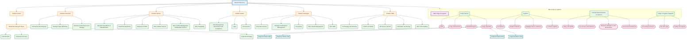

```mermaid
flowchart TD
    BOD[Board of Directors]
    BOD --> DU[Direktur Utama]
    DU --> DDB[Direktorat Dukungan Bisnis]
    DDB --> IA(Internal Audit)
    DDB --> CS(Corporate Secretary)
    DDB --> CST(Corporate Strategy)
    BOD --> DC[Direktur Komersial]
    DC --> CD(Commercial Development)
    DC --> SSM(Strategic Sales Marketing)
    DC --> BPS(Business Performance and Strategy)
    BOD --> DO[Direktur Operasi]
    DO --> OPS(Operation Excellence & Standarization)
    DO --> CX(Customer Experience)
    DO --> BP(Business Portfolio)
    DO --> SAS(SDU: Aviation Service)
    DO --> SFM(SDU: Facility Management & Manpower Service)
    DO --> SHO(SDU: Hospitality)
    BOD --> DR[Direktur Resiko]
    DR --> RM(Risk Management, Governance and Compliance)
    DR --> LG(Legal)
    DR --> PC(Procurement)
    BOD --> DK[Direktur Keuangan]
    DK --> CF(Corporate Finance)
    DK --> SPM(Strategic Performance Management)
    DK --> ACC(Accounting)
    DK --> SAM(SDU: Assets Management)
    DK --> SERP(SDU: ERP)
    BOD --> DH[Direktur SDM]
    DH --> HS(HC Strategy and Planning)
    DH --> HB(HC BP and Talent)
    DH --> HG(HC Service and GA)
    DH --> IT(Information Technology)
    DH --> SACA(SDU: IAS Academy)
    BOD --> SBUCLG[SBU Cargo & Logistics]
    subgraph SBUCLG["SBU Cargo & Logistics"]
        direction TB
        SBUCL[SBU Cargo & Logistics]
        SCS(Cargo Service)
        LOG(Logistics)
        CBE(Commercial & Business Excellence)
        CLS(Cargo & Logistics Supports)
    end
    SCS --> CGSL([Sales])
    SCS --> CI([Cargo Improvement])
    SCS --> RA([Regulated Agent])
    SCS --> GMCO([Cargo Operation])
    GMCO --> KNO>Regional Station KNO]
    GMCO --> CGK>Regional Station CGK]
    GMCO --> DPS>Regional Station DPS]
    GMCO --> UPG>Regional Station UPG]
    LOG --> AE([Air Express])
    LOG --> FF([Freight Forwarder])
    LOG --> BSS([Baggage Service Solutions])
    LOG --> CL([Contract Logistics])
    CBE --> PQ([Policy and QHSE])
    CBE --> KS([Key Account and Solutions])
    CBE --> BIP([Business Intelligence and Performance])
    CBE --> PO([Procurement Outbound])
    CLS --> SAF([Accounting & Finance])
    CLS --> SHL([HC and Legal])
    CLS --> SFS([Facility and System])

    classDef board fill:#e3f2fd,stroke:#1976d2,stroke-width:3px
    classDef directorate fill:#fff3e0,stroke:#f57c00,stroke-width:2px
    classDef sbu fill:#f3e5f5,stroke:#7b1fa2,stroke-width:2px
    classDef division fill:#e8f5e9,stroke:#388e3c,stroke-width:2px
    classDef department fill:#fce4ec,stroke:#c2185b,stroke-width:1px
    classDef section fill:#e0f2f1,stroke:#00796b,stroke-width:1px
    class BOD board
    class DU directorate
    class DC directorate
    class DO directorate
    class DR directorate
    class DK directorate
    class DH directorate
    class DDB directorate
    class IA division
    class CS division
    class CST division
    class SBUCL sbu
    class SCS division
    class LOG division
    class CBE division
    class CLS division
    class CGSL department
    class CI department
    class RA department
    class GMCO department
    class KNO section
    class CGK section
    class DPS section
    class UPG section
    class AE department
    class FF department
    class BSS department
    class CL department
    class PQ department
    class KS department
    class BIP department
    class PO department
    class SAF department
    class SHL department
    class SFS department
    class CD division
    class SSM division
    class BPS division
    class OPS division
    class CX division
    class BP division
    class SAS division
    class SFM division
    class SHO division
    class CF division
    class SPM division
    class ACC division
    class SAM division
    class SERP division
    class HS division
    class HB division
    class HG division
    class IT division
    class SACA division
    class RM division
    class LG division
    class PC division
```