<!---
aksara:true
-->

# Prepare 
npm install @types/jsonwebtoken @types/uuid argon2 jsonwebtoken uuid zod
git clone https://github.com/Ak-sara/sso.git
npm install

version: '3.8'

services:
  oauth-server:
    build: .
    ports:
      - "5173:5173"
    environment:
      - JWT_SECRET=your-production-secret-key
      - JWT_ISSUER=https://your-domain.com
    volumes:
      - .:/app
      - /app/node_modules

  # Optional: Add PostgreSQL for production
  # postgres:
  #   image: postgres:15
  #   environment:
  #     POSTGRES_DB: oauth_server
  #     POSTGRES_USER: oauth_user
  #     POSTGRES_PASSWORD: oauth_password
  #   ports:
  #     - "5432:5432"
  #   volumes:
  #     - postgres_data:/var/lib/postgresql/data

# volumes:
#   postgres_data:

// Dockerfile
FROM node:18-alpine

WORKDIR /app

COPY package*.json ./
RUN npm install

COPY . .

EXPOSE 5173

CMD ["npm", "run", "dev", "--", "--host", "0.0.0.0"]

// README.md
# OIDC OAuth Server

A complete OpenID Connect (OIDC) and OAuth 2.0 server implementation built with SvelteKit.

## Features

- **Full OAuth 2.0 Authorization Code Flow**
- **OpenID Connect (OIDC) Support**
- **PKCE (Proof Key for Code Exchange) Support**
- **JWT ID Tokens**
- **Refresh Token Support**
- **Admin Panel for User/Client Management**
- **Well-Known Discovery Endpoints**
- **Responsive UI with Tailwind CSS**

## Quick Start

1. **Install Dependencies**
   ```bash
   npm install
   ```

2. **Set Environment Variables**
   ```bash
   cp .env.example .env
   # Edit .env with your configuration
   ```

3. **Start Development Server**
   ```bash
   npm run dev
   ```

4. **Access Admin Panel**
   - Go to `http://localhost:5173/admin`
   - Create a user and OAuth client

## Endpoints

### Discovery
- `GET /.well-known/openid_configuration` - OIDC discovery document

### OAuth 2.0 / OIDC
- `GET /oauth/authorize` - Authorization endpoint
- `POST /oauth/token` - Token endpoint  
- `GET /oauth/userinfo` - UserInfo endpoint

### Admin
- `GET /admin` - Admin panel for managing users and clients

## Usage Example

1. **Create a client** in the admin panel
2. **Redirect users** to authorization endpoint:
   ```
   /oauth/authorize?response_type=code&client_id=YOUR_CLIENT_ID&redirect_uri=YOUR_CALLBACK&scope=openid email
   ```
3. **Exchange authorization code** for tokens:
   ```bash
   curl -X POST /oauth/token \
     -d "grant_type=authorization_code" \
     -d "code=AUTHORIZATION_CODE" \
     -d "redirect_uri=YOUR_CALLBACK" \
     -d "client_id=YOUR_CLIENT_ID" \
     -d "client_secret=YOUR_CLIENT_SECRET"
   ```
4. **Get user info** with access token:
   ```bash
   curl -H "Authorization: Bearer ACCESS_TOKEN" /oauth/userinfo
   ```

## Security Features

- Secure password hashing with Argon2
- JWT tokens with expiration
- PKCE support for public clients
- Authorization code expiration (10 minutes)
- Refresh token rotation
- Client secret validation

## Production Deployment

1. **Update Environment Variables**
   - Set strong `JWT_SECRET`
   - Update `JWT_ISSUER` to your domain
   - Enable HTTPS

2. **Use Production Database**
   - Replace in-memory storage with PostgreSQL/MySQL
   - Implement proper connection pooling

3. **Security Hardening**
   - Enable HTTPS only
   - Set secure cookie flags
   - Implement rate limiting
   - Add CORS headers

4. **Monitoring**
   - Add logging
   - Implement health checks
   - Monitor token usage

## License

BSD-License

```mermaid
flowchart TD
    subgraph DIR
        CD("Commercial Development")
        SSM("Strategic Sales Marketing")
        BPS("Business Performance and Strategy")
        OPS("Operation Excellence & Standarization")
        CX("Customer Experience")
        BP("Business Portfolio")
        SAS("SDU: Aviation Service")
        SFM("SDU: Facility Management & Manpower Service")
        SHO("SDU: Hospitality")
        RM("Risk Management, Governance and Compliance")
        LG("Legal")
        PC("Procurement")
        CF("Corporate Finance")
        SPM("Strategic Performance Management")
        ACC("Accounting")
        SAM("SDU: Assets Management")
        SERP("SDU: ERP")
        HS("HC Strategy and Planning")
        HB("HC BP and Talent")
        HG("HC Service and GA")
        IT("Information Technology")
        SACA("SDU: IAS Academy")
    end

    subgraph BOD
        direction TB
        DU["Direktur Utama"]
        DC["Direktur Komersial"]
        DO["Direktur Operasi"]
        DR["Direktur Resiko"]
        DK["Direktur Keuangan"]
        DH["Direktur SDM"]
    end

    subgraph DDB
        direction TB
        IA("Internal Audit")
        CS("Corporate Secretary")
        CST("Corporate Strategy")
    end

    subgraph DDDC
        direction LR
        CD("Commercial Development")
        SSM("Strategic Sales Marketing")
        BPS("Business Performance and Strategy")
    end

    subgraph DDDO
        direction LR
        OPS("Operation Excellence & Standarization")
        CX("Customer Experience")
        BP("Business Portfolio")
        SAS("SDU: Aviation Service")
        SFM("SDU: Facility Management & Manpower Service")
        SHO("SDU: Hospitality")
    end

    subgraph DDDR
        direction LR
        RM("Risk Management, Governance and Compliance")
        LG("Legal")
        PC("Procurement")
    end

    subgraph DDDK
        direction LR
        CF("Corporate Finance")
        SPM("Strategic Performance Management")
        ACC("Accounting")
        SAM("SDU: Assets Management")
        SERP("SDU: ERP")
    end

    subgraph DDDH
        direction LR
        HS("HC Strategy and Planning")
        HB("HC BP and Talent")
        HG("HC Service and GA")
        IT("Information Technology")
        SACA("SDU: IAS Academy")
    end

    BOD["Board of Directors"]
    DDB["Direktorat Dukungan Bisnis"]
    SBUCL["SBU Cargo & Logistics"]
    SCS("Cargo Service")
    LOG("Logistics")
    CBE("Commercial & Business Excellence")
    CLS("Cargo & Logistics Supports")
    CGSL(["Sales"])
    CI(["Cargo Improvement"])
    RA(["Regulated Agent"])
    GMCO(["Cargo Operation"])
    KNO[["Regional Station KNO"]]
    CGK[["Regional Station CGK"]]
    DPS[["Regional Station DPS"]]
    UPG[["Regional Station UPG"]]
    AE(["Air Express"])
    FF(["Freight Forwarder"])
    BSS(["Baggage Service Solutions"])
    CL(["Contract Logistics"])
    PQ(["Policy and QHSE"])
    KS(["Key Account and Solutions"])
    BIP(["Business Intelligence and Performance"])
    PO(["Procurement Outbound"])
    SAF(["Accounting & Finance"])
    SHL(["HC and Legal"])
    SFS(["Facility and System"])

    BOD --> DU
    BOD --> DC
    BOD --> DO
    BOD --> DR
    BOD --> DK
    BOD --> DH
    BOD --> SBUCL

    DC --> DU
    DO --> DU
    DR--> DU
    DK--> DU
    DH--> DU
    SBUCL --> BOD

    DU --> DDB
    DC --> CD
    DC --> SSM
    DC --> BPS
    DO --> OPS
    DO --> CX
    DO --> BP
    DO --> SAS
    DO --> SFM
    DO --> SHO
    DR --> RM
    DR --> LG
    DR --> PC
    DK --> CF
    DK --> SPM
    DK --> ACC
    DK --> SAM
    DK --> SERP
    DH --> HS
    DH --> HB
    DH --> HG
    DH --> IT
    DH --> SACA
    DDB --> IA
    DDB --> CS
    DDB --> CST
    SBUCL --> SCS
    SBUCL --> LOG
    SBUCL --> CBE
    SBUCL --> CLS
    SCS --> CGSL
    SCS --> CI
    SCS --> RA
    SCS --> GMCO
    LOG --> AE
    LOG --> FF
    LOG --> BSS
    LOG --> CL
    CBE --> PQ
    CBE --> KS
    CBE --> BIP
    CBE --> PO
    CLS --> SAF
    CLS --> SHL
    CLS --> SFS
    GMCO --> KNO
    GMCO --> CGK
    GMCO --> DPS
    GMCO --> UPG

    DU --> DDB
    BOD ~~~ SBUCL
    DC -.-> SBUCL

    classDef board fill:#e3f2fd,stroke:#1976d2,stroke-width:3px
    classDef directorate fill:#fff3e0,stroke:#f57c00,stroke-width:2px
    classDef sbu fill:#f3e5f5,stroke:#7b1fa2,stroke-width:2px
    classDef division fill:#e8f5e9,stroke:#388e3c,stroke-width:2px
    classDef department fill:#fce4ec,stroke:#c2185b,stroke-width:1px
    classDef section fill:#e0f2f1,stroke:#00796b,stroke-width:1px
    classDef s-teal fill:#339999
    classDef s-blue fill:#00a1f1
    classDef s-green fill:#34A853
    classDef s-yellow fill:#FBBC05,color:#000
    classDef s-red fill:#F14F21,color:#000
    classDef nofill fill:transparent
    classDef nostroke stroke:transparent
    class BOD board
    class DU directorate
    class DC directorate
    class DO directorate
    class DR directorate
    class DK directorate
    class DH directorate
    class DDB directorate
    class IA division
    class CS division
    class CST division
    class SBUCL sbu
    class SCS division
    class LOG division
    class CBE division
    class CLS division
    class CGSL department
    class CI department
    class RA department
    class GMCO department
    class KNO section
    class CGK section
    class DPS section
    class UPG section
    class AE department
    class FF department
    class BSS department
    class CL department
    class PQ department
    class KS department
    class BIP department
    class PO department
    class SAF department
    class SHL department
    class SFS department
    class CD division
    class SSM division
    class BPS division
    class OPS division
    class CX division
    class BP division
    class SAS division
    class SFM division
    class SHO division
    class CF division
    class SPM division
    class ACC division
    class SAM division
    class SERP division
    class HS division
    class HB division
    class HG division
    class IT division
    class SACA division
    class RM division
    class LG division
    class PC division
    class DU s-teal
    class DC s-teal
    class DO s-teal
    class DR s-teal
    class DK s-teal
    class DH s-teal
    class IA s-yellow
    class CS s-yellow
    class CST s-yellow
    class SCS s-yellow
    class LOG s-yellow
    class CBE s-yellow
    class CLS s-yellow
    class SAS s-green
    class SFM s-green
    class SHO s-green
    class SAM s-green
    class SERP s-green
    class SACA s-green
    class DIR nofill,nostroke
    class DDB nofill,nostroke
    class DDDC nofill,nostroke
    class DDDO nofill,nostroke
    class DDDR nofill,nostroke
    class DDDK nofill,nostroke
    class DDDH nofill,nostroke

```

